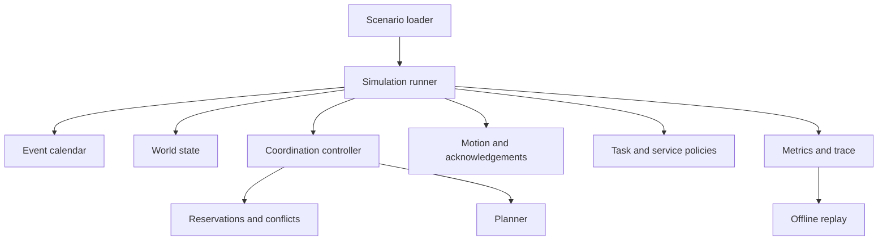

# AMR DES Sim — Standalone Project Plan and Codex Build Specification

Version: 3.0  
Deliverable type: implementation specification; no application code has been generated by this document.  
Proposed repository: `amr-des-sim`  
Python package: `amr_des`  
CLI: `amr-des`

## 1. Authoritative project decision

Create a NEW standalone project from an empty repository. Do not extend or import the existing simulator as a runtime dependency. Implement compatible map/layout readers, workload grouping, workstation mapping, and AGV dispatch inside the new project, using layout-management as their source reference. Do not modify either reference repository. The previous architecture that proposed integrating new components into the existing simulator is superseded by this plan.

Use `s-w3i/layout-management` branch `agent/hierarchical-physical-slotting`, inspected commit `2cc2b4fbaa377da0fb74bf41407fb5c85f1732b0`, for map/layout ingestion and workload/dispatch behaviour. Use `s-w3i/dram_ws` at branch `field-testing` as the executed planning and coordination reference. The inspected baseline is commit `cff7348baee18c315a9771bfb014b20a71bcc4f8`. Pin that commit for reproducibility; do not silently track branch changes while generating code.

Implement ordinary Python algorithms and a discrete-event simulation runtime. The finished application must run without ROS 2, DDS, Gazebo, ROS messages, ROS services, robot HTTP servers, or either source checkout. No external service is needed to execute tests, simulations, or replay.

The goal is a fast, deterministic simulator for warehouse AMR traffic and throughput. The algorithmic alignment target is the coordination decisions made for identical routes, robot states, ordered observations, and effective configuration. It is not full physical-robot fidelity or a guarantee of equal field throughput.

## 2. Scope and explicit simplifications

### Required for version 1

- Directed navigation graph with node coordinates, rack annotations, and shared traffic resources.
- Multiple robots, date/store workload groups, rack-presentation jobs, fixed service durations, and layout-compatible deterministic dispatch.
- A DRAM-derived executed-route planner and a separate layout-compatible pickup estimator used only for dispatch ranking.
- DRAM-derived priority ordering, reservation allocation, command acknowledgements, conflict detection, passage tracking, and conflict resolution.
- Event-driven analytical motion, configurable acknowledgement latency, and modelled replan latency.
- Terminal outcomes for completed, blocked, no-path, safety-failed, and horizon-limited runs.
- File-based input, command-line execution, Python API, batch runs, machine-readable metrics, detailed optional traces, and offline browser replay.
- Golden coordination fixtures, invariant tests, integration scenarios, and performance measurements.

### Authoritative source boundaries — revised scope

The latest requirements supersede the earlier generic FCFS assignment and static-distance planner choices. This remains a new project, with algorithms reimplemented through independent Python interfaces.

| Area | Behavioural source | Required version 1 behaviour |
|---|---|---|
| Map and layout | layout-management | Read the same map/grid-project JSON and slotting JSON directly, preserving topology, coordinates, IDs, rack membership, and endpoint markers |
| Order ingestion and grouping | layout-management | Read the same Excel workbook; group by date/store and count lines per SKU |
| Workstation distribution | layout-management | Store-to-station load balancing over the selected dataset, including overrides and exact tie-breaks |
| Rack/job selection and AGV assignment | layout-management | Same coverage-based rack selection and predicted pickup-time AGV ranking |
| Executed path planning | dram_ws actual profile | Port the active A* path, turning and edge-cost semantics, load restrictions, and directed tabu handling |
| Multi-robot coordination | dram_ws | Reservations, command progress, conflict detection/resolution, passages, and replanning |
| Robot kinematics | layout-management | Linear/angular acceleration, source motion parameters, pose interpolation, and source-compatible granted-chunk timing |
| Debug UI and KPI definitions | layout-management | Rendered playback controls/overlays and complete daily/aggregate KPI schemas, implemented in this project |
| Runtime | New project | Deterministic discrete-event kernel and analytical motion without ROS |
| Fleet size | layout-management configuration | Configured spawn list and first-N override; no DRAM fleet-size requirement |
| Rack return | layout-management lifecycle | Return to fixed rack home and finish after jack-down |
| Workstation processing | New simple service implementation informed by layout-management | Configured service duration and exclusive physical occupancy; no requirement to emulate DRAM workstation protocols |

The original exclusions for **task allocation and active planning are now superseded**. Workstation assignment is required to match layout-management; detailed workstation queue/physical-service fidelity remains a separate question from that assignment rule.

A MAPF module does not allocate customer orders to robots. Keep the workload/dispatch boundary separate from multi-robot navigation. MAPF here means the referenced planner-plus-coordination stack, not an assumption that the deployment uses CBS or a globally optimal joint planner.

Defer battery charging, hardware failures, full geometric dynamics, web backends, live networking, SKU stock optimization, and automatic layout optimization. Excel order ingestion is now required. Minimum-SKU/EA stock calculations remain outside simulation workload generation: the source workload counts order lines, not stock quantities.

## 3. Technology decisions

- Python 3.11 or newer, `src/` package layout, `pyproject.toml`, console entry point.
- Standard library at runtime: `dataclasses`, `enum`, `typing`, `heapq`, `math`, `json`, `csv`, `argparse`, `hashlib`, `pathlib`, and `concurrent.futures` for independent batch workers.
- JSON for versioned internal scenarios/configuration and native map/slotting files. Required `openpyxl` dependency for the existing Excel order workbook; lock a compatible version. Parse the reference YAML profile during development or transcribe verified values into JSON; ROS remains unnecessary.
- Debug dependency: Matplotlib, with lazy imports so headless batch runs do not require a GUI backend. Development tools: pytest, Ruff, and a type checker; choose compatible versions when creating the project and record them in the development environment specification.
- No SimPy dependency: use an explicit event calendar because deterministic phases and command/route invalidation are central requirements.
- Required rendered debug UI: a standalone Matplotlib desktop window matching layout-management controls, map overlays, and cumulative KPI display; install through a `debug` extra. Also retain self-contained HTML replay/report export for sharing and headless environments. No CDN or server required.
- Use SI units externally: metres, seconds, metres/second, metres/second squared. Convert time once at input boundaries to integer microseconds.

Do not add a database, message broker, dependency-injection framework, or distributed simulation engine for version 1.

## 4. Repository layout

Every file below has an implementation responsibility. It is a target organization, not permission to generate empty files.

```text
amr-des-sim/
  pyproject.toml
  README.md
  AGENTS.md
  PROJECT_PLAN.md
  THIRD_PARTY_NOTICES.md
  src/amr_des/
    __init__.py
    __main__.py
    api.py
    cli.py
    config.py
    domain/
      graph.py
      robot.py
      task.py
      state.py
      decisions.py
    kernel/
      calendar.py
      events.py
      runner.py
      invariants.py
    planning/
      interface.py
      dram_astar.py
      dram_costs.py
      dispatch_estimator.py
    coordination/
      controller.py
      reservations.py
      priority.py
      conflicts.py
      passages.py
      resolution.py
      deadlines.py
    motion/
      trajectory.py
      controller.py
    operations/
      workload.py
      workstation_assignment.py
      dispatcher.py
      services.py
      shelves.py
    io/
      scenario.py
      layout_map.py
      layout_slotting.py
      order_workbook.py
      layout_config.py
      compile_inputs.py
      serialization.py
      outputs.py
    observability/
      metrics.py
      trace.py
      replay.py
      report.py
      kpi_schema.py
    debug/
      controller.py
      scene.py
      matplotlib_ui.py
  profiles/
    dram_actual.json
    abstract_safe.json
  examples/
    minimal.json
    crossing.json
    following.json
    corridor_escape.json
    shelf_cycle.json
    impossible_swap.json
  tests/
    unit/
    contracts/
    integration/
    fixtures/dram/
    fixtures/layout_management/
  benchmarks/
    generate_scenarios.py
    run_benchmarks.py
  docs/
    architecture.md
    input-schema.md
    event-semantics.md
    motion-contract.md
    debug-ui-contract.md
    kpi-dictionary.md
    dram-contract.md
    layout-contract.md
    known-divergences.md
    validation-report.md
    performance-report.md
    implementation-status.md
  .github/workflows/ci.yml
```

`profiles/abstract_safe.json` is a documented alternate policy profile, not a second engine. Implement it after the reference coordination path works. It must not be used to hide failing compatibility tests.

## 5. Ownership and component architecture



The runner is the only authority that commits world mutations. Coordination algorithms take immutable views and produce decisions or deltas. The runner validates and applies those deltas atomically. A decision must not schedule hidden callbacks or mutate another component directly.

Graph topology and resolved configuration are immutable during a version 1 run; MAPF cost/occupancy snapshots are versioned dynamic state. There is one authoritative reservation table and one authoritative physical occupancy model. Cached views must derive from them.

The calendar knows event ordering, not warehouse business rules. The executed-route planner knows graph and route constraints, not order grouping or ROS. The dispatch estimator is a separately named compatibility component, not an alternate movement planner. Metrics observe events without changing simulation state.

## 6. Inputs: native warehouse files and internal test scenarios

### Primary user input path

Accept `map.json` (also exported as `*.grid.json`), `slotting.json` (also `*.slotting.json`), the original order workbook, and simulation config. Filenames do not define schemas: use the source schema tags. Do not require users to manually convert these into the synthetic node/edge/stage JSON below.

Pipeline: native map + native slotting + workbook + config → validated internal graph, rack catalog, date/store tasks, station mapping and fleet → standalone simulation. Preserve original data and an ID mapping/provenance manifest. Compilation is deterministic and can be cached by file content hashes, parser version, selected dates, and relevant settings.

The internal scenario schema below remains useful for small tests; the warehouse-input path is the production interface. It must not flatten all store work into predetermined stage tasks because rack/AGV choices are made dynamically at dispatch.

### Map-reading contract

Reimplement `RmfMapService.load_project`, `GridProject.from_project_dict`, coordinate calculation, active position enumeration, and traversable lane enumeration. Support the pinned source's current and legacy schema tags. Preserve grid origins/spacing, coordinate overrides, deleted positions, deleted/added lanes, one-way lane direction, marker roles/endpoint IDs, and valid source metadata. Build both directed traversals for bidirectional lanes; never infer reverse edges for one-way lanes.

Preserve storage layout, zones, and attributes needed for validation or display without inventing new travel restrictions. Port source validation of inconsistent lanes/coordinates. Grid position, waypoint label, rack ID, and workstation endpoint ID are distinct concepts: maintain explicit bijective mappings where possible and diagnose ambiguity. The DRAM graph adapter must use these mappings rather than assume every imported ID already follows a field robot naming convention.

### Slotting-reading contract

Reimplement the relevant normalization from `SlottingLayoutRepository.load`; require a supported schema, building object, and assignments list. Retain hierarchical storage/slot information for rendering and provenance. Reproduce `racks_from_layout` for simulation: include rows whose `assignment_status` is absent/None or `ASSIGNED`, normalize SKU/rack identifiers, aggregate a SET of SKUs per rack, and derive rack grid positions using the source ID parser.

Multiple slots containing the same SKU in a rack do not create multiple racks or extra demand. Do not turn `quantity`, minimum-stock EA, or slot capacity into consumable simulated stock: the source uses SKU availability membership for rack presentations. Validate map/rack/station/spawn reachability and report missing SKU coverage, disabled station references, or incompatible map/layout identities. Compare compatible identity fields rather than requiring every optional metadata field to be identical.

### Workbook and grouping contract

Use the same data file as layout-management; no synthetic demand generation in compatibility runs. Scan sheets in workbook order, inspecting the first 50 rows for `Date`, `Store ID`, and `Item or SKU`. Use the first matching header. Port date and identifier normalization, including numeric Excel dates and integral numeric IDs. Match invalid-row rejection and row diagnostics; do not silently drop bad required rows.

For each valid row, increment `line_counts[sku]` by ONE under `(calendar_date, store_id)`. `Quantity (in EA)` is not used. Preserve repeated lines. Emit tasks sorted by date/store with IDs `YYYY-MM-DD/store` and release time zero in each independent daily simulation. Select inclusive date bounds before assigning workstations. Reset robot/rack/task state per day, as the source batch runner does; do not simulate continuous overnight carryover by default.

### Workstation distribution contract

Across ALL selected tasks, sum source-line counts per store. Apply explicit store overrides first in sorted order, adding their loads. Sort remaining stores by descending line total then store ID. Assign each to the station minimizing `(current_line_load, station_id)` and update load. Keep this mapping fixed across the selected dates and every compared slotting layout. Recomputing independently per day or per layout changes the comparison.

Reject overrides for unknown stores or disabled stations as the source does. Export the selected date range, per-store load, station mapping, and resulting station loads.

### Dispatch and AGV distribution contract

Port `_Engine._dispatch` behaviour as a standalone function over a snapshot:

1. Keep daily tasks ordered by task ID and examine released tasks with outstanding SKUs in that order.
2. Collect racks containing any outstanding SKU. Exclude logically reserved racks.
3. Rank racks by `(-number_of_distinct_covered_SKUs, Euclidean_distance_to_assigned_workstation, rack_id)`. This does NOT rank by covered line count or actual delivery travel time.
4. For the first ranked rack with a feasible robot, evaluate free AGVs. Respect current rack-node ownership; a different owner makes that pickup unavailable.
5. Use the layout-compatible pickup route and motion estimator, including current heading, linear/angular motion settings, and route tie-breaks. Choose `(predicted_pickup_time, AGV_id)`.
6. Remove ALL outstanding line counts for the covered SKUs, create a rack-presentation job, increment task inflight count, reserve the rack, and mark that AGV busy. Continue dispatch until no feasible choice exists.
7. Finish a job only after rack return and jack-down; release rack/AGV, decrement inflight, add covered line counts to completed lines, and redispatch. A store task completes only when outstanding is empty AND inflight is zero.

One date/store task may have several concurrent rack-presentation jobs assigned to different AGVs. Do not apply the earlier synthetic rule that one robot owns an entire store task.

Initialize AGVs as `AMR_01`, `AMR_02`, etc. in configured spawn order with configured heading. A fleet override uses the first N source spawn nodes. Preserve configuration for workstations, store overrides, motion estimates, jack-up/down, and service duration.

### Separate dispatch estimates from executed paths

The pickup estimator reproduces layout-management `GridRouter.route`, straight-run grouping, `motion_phases`, and `predicted_motion_time`, including source rack-obstacle rules and tie-breaks. Its result selects a robot only. The DRAM planner independently plans the path that the selected robot executes; the estimator's route must not bypass DRAM planning.

This preserves dispatch DECISIONS for identical input snapshots. Full run assignment sequences can still differ because DRAM motion/coordination changes when robots become free and where/with what heading they are available. Test snapshot-level parity and report trajectory-dependent differences honestly. If the DRAM planner rejects a selected pickup, report explicit execution/no-path failure; do not silently substitute a new selection rule.

### Scenario envelope

Required fields: `schema_version`, `scenario_id`, `seed`, `horizon_s`, `graph`, `robots`, and `tasks`. Optional fields: `stations`, `shelves`, and `config_overrides`. Unknown fields are errors in the synthetic scenario envelope unless explicitly reserved as metadata. Native map/slotting inputs preserve valid source metadata and must not be rejected merely for fields outside the simulation subset.

### Graph

Each node has a unique string `id`, finite `x_m` and `y_m`, and `kind` from `transit`, `rack`, `station`, or `parking`. Nodes have physical capacity one in version 1.

Each directed edge has `from`, `to`, strictly positive `length_m`, and optional `conflict_resources`. Bidirectional movement requires two edges. Euclidean coordinates are used for turn geometry and replay. Validate length against geometry when using the Euclidean A* heuristic; otherwise use a zero heuristic.

Resource IDs identify crossings or narrow sections shared by otherwise different edges. Each such resource has capacity one initially. Treat each physical edge as an exclusive resource in both directions by default. This is a conservative physical abstraction; same-edge following can be added only with a separate headway model.

### Robots

Fields: `id`, `start_node`, `loaded`, `priority`, and optional per-robot motion overrides. Use the source motion fields `max_linear_speed_mps`, `linear_acceleration_mps2`, `max_angular_speed_degps`, and `angular_acceleration_degps2`; source profiles use symmetric acceleration/deceleration and the same limits loaded/unloaded. Preserve configured initial heading. Start nodes must be distinct and motion rates/accelerations finite and positive. Loaded speed changes and asymmetric braking are optional non-compatibility extensions, disabled by default. Do not use a fixed turn duration in the source-compatible profile.

### Tasks

Use a stage-based representation:

```json
{
  "id": "T1",
  "release_time_s": 0,
  "stages": [
    {"goal_node": "PICK", "service_duration_s": 2, "action": "load", "shelf_id": "S1"},
    {"goal_node": "WS", "service_duration_s": 5, "action": "none", "station_id": "W1"},
    {"goal_node": "PICK", "service_duration_s": 2, "action": "unload", "shelf_id": "S1"}
  ]
}
```

Allowed actions are `none`, `load`, and `unload`. Apply load changes at service completion. Zero-duration service is allowed and must obey microstep rules. In synthetic stage scenarios a task holds its robot through all stages. In warehouse mode, each rack-presentation JOB holds a robot; a date/store workload task can have multiple jobs in flight. Multiple stages at the same node do not require a synthetic move.

For a shelf-cycle task, reserve the shelf logically when dispatching its task, release it on successful return, and reject inconsistent home/return definitions. Keep later same-shelf jobs queued while it is in use; never let two robots carry it. Empty robots may enter rack nodes; loaded robots may enter their explicit unload destination but not unrelated rack nodes.

### Stations and task completion

In synthetic scenarios, a station lists service node(s), optional staging nodes, and capacity no larger than its number of service nodes. In warehouse mode, derive one-capacity stations from configured map workstation markers; do not require users to add staging nodes or change their existing files. When staging is absent, robots wait at the last safely admitted path location under MAPF resource control. Assign service slots FCFS. When staging is configured, wait at a reserved staging node; never stack robots on a service node. If no staging node is available, the robot stays at its current safe location and retries on a resource release.

Service completion releases the logical processing slot, but physical node ownership persists until departure. Allow immediate next-stage routing. A task ending at a service node must specify a parking destination or explicitly allow that robot to remain and obstruct the node. The sample warehouse tasks should end at home or parking to avoid accidental permanent station blockage.

### Complete minimal input

```json
{
  "schema_version": 1,
  "scenario_id": "minimal",
  "seed": 42,
  "horizon_s": 60,
  "graph": {
    "nodes": [
      {"id": "A", "x_m": 0, "y_m": 0, "kind": "parking"},
      {"id": "B", "x_m": 1, "y_m": 0, "kind": "transit"},
      {"id": "C", "x_m": 2, "y_m": 0, "kind": "parking"}
    ],
    "edges": [
      {"from": "A", "to": "B", "length_m": 1},
      {"from": "B", "to": "C", "length_m": 1}
    ]
  },
  "robots": [{
    "id": "R1", "start_node": "A", "loaded": false, "priority": 0,
    "motion": {"max_linear_speed_mps": 1, "linear_acceleration_mps2": 1,
      "max_angular_speed_degps": 90, "angular_acceleration_degps2": 90}
  }],
  "tasks": [{
    "id": "T1", "release_time_s": 0,
    "stages": [{"goal_node": "C", "service_duration_s": 0, "action": "none"}]
  }]
}
```

Validate all references, duplicate IDs, non-finite numbers, negative durations, action consistency, resource definitions, and configuration ranges. A structurally valid but disconnected route is a `FAILED_NO_PATH` simulation outcome, not malformed JSON.

## 7. Configuration and provenance

Resolve defaults, named profile, and scenario overrides in that order. Write the resolved configuration to the output directory. Use explicit internal names and record their source mapping.

| Setting | Initial value | Status |
|---|---:|---|
| `allocation_period_s` | 1.0 | Source allocator timer |
| `allocation_phase_s` | 0.0 | Simulator convention |
| `max_candidates_per_allocation` | 5 | Actual bring-up effective fallback |
| `allocation_strategy` | `ascPathLength` | Effective source default |
| `straight_turn_threshold_deg` | 10.0 | Source segment helper |
| `head_to_head_window` | 3 | Actual profile |
| `partial_cycle_window` | 5 | Actual launch mapping to `trivial_cyclic_window` |
| `deadlock_window` | 5 | Actual profile |
| `overlap_window` | 3 | Detector default; verify in contract stage |
| `ack_latency_s` | 0.05 | Synthetic default, not a field measurement |
| `planner_latency_s` | 0.0 | Synthetic default |
| `unresolved_timeout_s` | 30.0 | Simulator failure policy, not field behaviour |
| `max_same_time_microsteps` | 10000 | Diagnostic limit |
| `kinematics_mode` | `layout_compatible` | Source granted-chunk linear/angular timing; optional continuous mode labelled separately |
| `trace_level` | `summary` | `none`, `summary`, or `full` |
| `epoch_mode` | `periodic` initially | Add `optimized` after equivalence testing |

Do not reinterpret the five-candidate limit as a global five-reservation limit. The field code appends to a movement buffer and also has a separate buffer-size gate. Derive and test the exact outstanding-buffer behaviour from the pinned source.

All source-specific literal thresholds belong in the resolved policy configuration or documented compatibility constants, not scattered unexplained numbers.

## 8. Domain state and public interfaces

### Robot runtime state

Store robot/task/stage IDs; load and priority; goal; immutable full route plus route version; physical edge/node and trajectory; acknowledged path index; next allocation index; committed command entries; current resolution; blocker IDs; wait start times; frontier-arrival time; tabu directed edges; and pending route-request ID. In warehouse mode retain distinct workload-task ID and rack-presentation job ID.

Use `(route_version, path_index)` to distinguish repeated visits to the same node. Track command generations because numeric command IDs can wrap. A node ID alone cannot identify a visit.

### Global state

Store current simulated time, robots, tasks, shelves, stations, node owners, active edge/resource occupancy, per-robot owned resources, wait-for dependencies, pending allocation epochs, pending deadlines, and terminal status.

### Core APIs

```python
def compile_warehouse_inputs(map_path: Path, slotting_path: Path, orders_path: Path, config: SimulationConfig, date_range: DateRange) -> WarehouseDataset: ...
def assign_workstations(tasks: tuple[WorkloadTask, ...], config: SimulationConfig) -> dict[str, str]: ...
def select_dispatch(view: DispatchView, estimator: PickupEstimator) -> DispatchDecision | None: ...
def load_scenario(path: Path) -> Scenario: ...
def validate_scenario(scenario: Scenario) -> None: ...
def simulate(scenario: Scenario, config: SimulationConfig) -> SimulationResult: ...
def write_result(result: SimulationResult, output_dir: Path) -> None: ...

class Planner(Protocol):
    def plan(self, request: RouteRequest, graph: Graph) -> RouteResult: ...

def allocation_order(view: CoordinationView, strategy: str) -> tuple[str, ...]: ...
def allocate(view: CoordinationView, now_us: int) -> AllocationDecision: ...
def detect_conflicts(view: CoordinationView) -> tuple[Conflict, ...]: ...
def resolve_conflicts(view: CoordinationView, conflicts: tuple[Conflict, ...]) -> tuple[ResolutionDecision, ...]: ...
```

These signatures specify contracts; implementation must replace ellipses with working logic. Result types must represent failure explicitly, rather than using an empty route for both success-at-goal and failure.

Separate `field_policy_decision` from `physical_admission_result`. A conservative motion guard may delay a DRAM grant's execution; record that difference. Never call such a run end-to-end field-equivalent.

## 9. Event kernel

Use heap ordering `(time_us, microstep, phase, sequence)`. Event types are enums with typed payloads. Sequence numbers are deterministic; iteration over sets must be sorted before it can affect scheduling.

| Phase | Events | Purpose |
|---|---|---|
| 0 | `NODE_ARRIVED`, `TURN_COMPLETED`, `SERVICE_COMPLETED` | Commit physical/service completion |
| 1 | `COMMAND_ACKNOWLEDGED` | Advance command progress and release passed reservations |
| 2 | `TASK_RELEASED`, `ROUTE_READY`, `LOAD_CHANGED`, `POLICY_DEADLINE` | Introduce changed inputs |
| 3 | `CONFLICT_SCAN`, `RESOLUTION_APPLIED` | Coordination decisions |
| 4 | `ALLOCATION_EPOCH` | Grants in field order |
| 5 | `COMMAND_ACCEPTED`, `MOTION_STARTED`, `BRAKING_STARTED` | Authorized trajectory transitions |
| 6 | `OBSERVATION` | Optional trace/metric snapshots |

If a handler schedules an earlier phase at the same time, place it in the next microstep. Processing the same phase is allowed in sequence order, subject to the same-time cycle limit. Forbid past timestamps. Zero-time causal cycles fail with the recent causal event chain.

Positive motion durations must advance by at least one microsecond. Use a defined quantization policy. Analytical times below resolution must not create a nonterminating zero-time loop.

```python
while calendar and not terminal:
    event = calendar.pop()
    if event.time_us > horizon_us:
        finalize_at_horizon()
        break
    if event_is_obsolete(event, world):
        record_discard(event)
        continue
    advance_clock(event.time_us)
    decision = dispatch(event, world.read_view())
    validate_and_commit(decision)
    enqueue_followup_events(decision)
    update_metrics(decision)
```

Use trajectory versions to invalidate replaced future motion. Validate route results against their request and graph version. Keep old committed command identities long enough to accept their legitimate delayed acknowledgements even after a route version changes.

Do not use a fixed `while time += dt` loop, render ticks, wall-clock sleeps, or a background timer thread.

## 10. Reservation and acknowledgement protocol

1. Register a route and preserve current physical-node ownership.
2. Schedule the next eligible allocation epoch.
3. Compute loaded-first ordering, source-compatible straight segment candidates, ownership checks, passage checks, and current-resolution effects.
4. Commit grants and command records atomically. Lower-priority robots in the same epoch see earlier committed grants.
5. Start or extend motion only inside the authorized prefix and after physical resource admission.
6. Physical arrival updates occupancy and schedules a controller acknowledgement after configured latency.
7. Acknowledgement advances monotonically through committed command progress and releases only the passed prefix, retaining the acknowledged/current location appropriately.
8. Wake robots depending on released resources and schedule relevant future allocation/conflict processing.
9. Stage completion requires physical arrival, acknowledgement of destination, and any service completion. Preserve destination occupancy while idle.

Duplicate/out-of-order acknowledgements must be idempotent and cannot roll progress backward. During the interval between physical arrival and acknowledgement, reservations may conservatively lag physical occupancy. This delay is intentional.

An occupied edge cannot be entered in the opposing direction. Reserve/admit intermediate shared resources before beginning the affected segment; release on actual physical clearance rather than an unrelated node acknowledgement.

## 11. Reference algorithm extraction

Before writing coordination logic, inspect the pinned source and produce `docs/dram-contract.md`. For every function record inputs, persistent state, ordering, outputs, timing assumptions, fixture IDs, and any deliberate divergence.

| Source file | New responsibility |
|---|---|
| `periodic_allocator.py` | Allocation, windows, buffer progress, timeout-driven recovery |
| `priority_scheduling.py` | Loaded-first grouping, strategy keys, tie-breaks |
| `mutex_passage.py` | Passage availability and wait-for state |
| `conflict_detection_node.py` | Head-on, overlap, partial-cycle, wait-for and corridor reports |
| `conflict_resolution.py` | Wait/clear/replan, action aggregation, corridor-side selection |
| `actual.bringup.launch.py` and `actual_params.yaml` | Effective profile |
| Command consumers and state producers used by actual bring-up | Meaning of wait, command acceptance, and completion |

Known pitfalls from inspection:

- Launch supplies `alloc_order_strategy`; allocator reads `priority_strategy`. Current defaults match. Normalize to one new key and document the discrepancy.
- Straight-segment endpoint selection excludes an append at a detected turn. Do not substitute an intuitive corner rule without a fixture.
- The allocator's `wait` case falls through to allocation. Inspect consumers before implementing a universal motion stop.
- Replan initiation waits for movement-buffer size at most one. Do not teleport the robot to the new route's start.
- A local `robot_can_replan` check looks for an unoccupied adjacent node respecting loaded-rack restrictions. It does not establish goal reachability.
- Corridor-side selection considers mobility, follower count, and priority, not just one robot's priority.
- Resolver action aggregation includes `clear`, and `replan` takes precedence. Preserve conflict history transitions.
- A recovery branch checks conflict duration and frontier-arrival duration with strict `> 5.0`, and applies an unloaded-robot condition.
- Tabu restrictions are directed edges. Preserve direction and source clearing lifecycle.

Use source-derived pure-function fixtures from BOTH repositories as the initial oracle. Export normalized map topology, rack memberships, grouped workloads, station mappings, and dispatch selections from layout-management into independent parity fixtures. Fixture metadata must state whether expected values came from executable extraction, manual source derivation, or a recorded field trace. Do not describe manually authored expectations as field measurements.

If source access is unavailable, implement generic kernel, inputs, motion, task models, and planner first; mark reference-dependent work blocked with exact missing files. Do not invent verified DRAM parity. Keep the default profile's validation status explicit until the reference contracts pass.

Check the reference's applicable license and notices before copying code. Keep required attribution in `THIRD_PARTY_NOTICES.md`; a new project does not erase third-party obligations.

## 12. Planning, conflicts, and replanning

Use the actual `dram_ws` profile as the initial MAPF execution baseline: `path_planner.py` with the heuristic selector disabled. Port its single-path search, predecessor/turning state, edge directionality, occupancy/load exclusions, tabu interpretation, route-start selection, tie-breaking, and configured cost calculation; do not replace it with a generic distance-only A* and claim parity. Keep a simple deterministic planner only as a test oracle or explicitly separate baseline profile.

The source edge cost includes geometric base distance plus weighted heat/directional costs; turning cost uses angle and a configured penalty. Inspect effective epsilon/search behaviour on the selector-disabled code path rather than assuming the weighted-search declaration controls every branch. Inventory active cost producers in actual bring-up, including edge heat and directional costs. Port the cost-producing rules needed by that profile as in-process computations driven by simulated path/occupancy changes and any semantically relevant update times. Missing cost observations must not silently become zero in a claimed parity test.

The comparison contract takes explicit cost snapshots as well as graph/state input. Implement the required cost-layer updates and test them independently. Cache invalidation must include cost revision, load restrictions, and tabu state. Defer optional selector/WHCA*/CBS profiles; they are not needed to reproduce the pinned actual A* configuration.

Feed graph geometry and rack annotations from layout-management into a DRAM graph adapter. Preserve source-coordinate units and directed connectivity. Emit goals from selected rack jobs; do not import DRAM task allocation, warehouse map, or workstation assignment. Document any differences between DRAM rack-transit permissions and the layout pickup estimator; they serve different contracts.

Preserve the source's conflict-window indexing and classifications. Do not add time-based prediction to the compatibility detector and silently change its decisions. Physical collision checks remain a separate layer.

When replanning:

1. Record the chosen participants, reason, and tabu edges according to the DRAM contract.
2. Drain/preserve the committed movement prefix according to the contract.
3. At a valid anchor state, capture the request ID and route version.
4. Compute a route. Publish the result as a simulated completion event after configured planning latency.
5. Reject obsolete results. On success replace the uncommitted suffix and request allocation.
6. On no path, preserve safe occupancy and emit an explicit no-path outcome with conflict context. Do not remove constraints automatically to manufacture success.

Report repeated nonprogress separately from a transient dependency cycle. A future acknowledgement or service completion may legitimately resolve a cycle. Use dependency-specific deadlines and scheduled-event knowledge before classifying terminal deadlock.

## 13. Robot kinematics — required layout-management compatibility

The model is a planar, rotate-then-translate approximation with acceleration limits. It is not wheel-level dynamics, swept-footprint collision simulation, or a calibrated hardware controller. Load state drives task/coordination state and rendering; the reference does not automatically slow loaded robots.

### Source parameters and modes

Read `motion.max_linear_speed_mps`, `motion.linear_acceleration_mps2`, `motion.max_angular_speed_degps`, `motion.angular_acceleration_degps2`, and `initial_heading_degrees` directly from the existing config. Source defaults are 1.5 m/s, 0.75 m/s², 90 deg/s, and 90 deg/s²; imported values take precedence. Convert angular quantities to radians internally exactly once. Import jack-up, jack-down, and workstation-service durations separately; they are stationary operations, not travel.

Use `kinematics_mode=layout_compatible` by default. Optional `continuous_frontier` mode may be added after compatibility tests pass and must be identified in every result. Never mix modes in an unlabeled layout comparison.

### Phase generation

Port `motion_phases`, `merge_straight_runs`, `GridRouter.motion`, `crossing_times`, and `MotionSegment.pose_at` through new local interfaces. For distance or absolute angle `q`, maximum linear/angular rate `v`, and symmetric acceleration `a`:

```text
threshold = v*v/a
if q <= source_zero_tolerance:
    no phases
elif q <= threshold + source_boundary_tolerance:
    peak = sqrt(q*a)
    t_acc = t_dec = peak/a
    q_acc = q_dec = q/2
else:
    t_acc = t_dec = v/a
    q_acc = q_dec = v*v/(2*a)
    q_cruise = q - q_acc - q_dec
    t_cruise = q_cruise/v
```

Preserve source tolerances in parity tests: the inspected zero and boundary tolerance is `1e-12`. Straight-run merging uses geometric collinearity with cross-product tolerance `1e-9` and positive dot product. Do not reuse DRAM's 10-degree reservation-segment threshold as the physical straight-run merging rule: they serve different purposes.

Before each straight run, compute the shortest signed rotation with `(angle + pi) % (2*pi) - pi`. Apply angular acceleration/cruise/deceleration at the fixed turning point, then linear acceleration/cruise/deceleration along the run. Preserve heading between runs, jobs, and idle periods. Export phase kinds compatible with `rotate_accel`, `rotate_cruise`, `rotate_decel`, `linear_accel`, `linear_cruise`, and `linear_decel`, plus stationary states.

### Granted-chunk execution

The source `_move_reserved` builds a route from the current location through the granted prefix and calls the rest-to-rest motion generator for that chunk. Therefore identical routes can have different total travel time when split into different granted chunks. Version 1 must support this explicitly instead of assuming full-route subdivision invariance.

In default `layout_compatible` mode, freeze an accepted chunk's trajectory through its rest endpoint. Newly granted commands may queue for the next chunk; they do not retroactively remove its deceleration. Schedule acknowledged releases and future chunk starts independently. Within one collinear chunk, intermediate graph nodes do not cause extra stops.

In optional `continuous_frontier` mode, extend/recompute from the actual nonzero velocity, retaining stopping distance before the authorized frontier. This mode is a different kinematic execution policy, not exact old-simulator timing. Keep commanded duration, simulated planning delay, acknowledgements, and queue waits separately accounted.

The DRAM allocator still controls which nodes are granted and when. Matching the source motion formula does not imply matching full-run duration when grants/routes differ.

### Interpolation and event generation

For each phase use `q(t)=q0+v0*t+0.5*a*t²`. Translation uses the segment heading; rotation changes only heading. Clamp pose evaluation to phase bounds, normalize angles, and derive node-crossing times by solving distance within the analytic phase. Render intermediate poses without simulating frame ticks. Capture linear/angular rates as well as pose for debug inspection.

Record current load state across stationary periods; do not blindly reset a failed or paused loaded robot to unloaded because its most recent movement segment ended. Node arrival, motion tail, and acknowledgement are distinct events.

### Numerical acceptance cases

- Straight 2 m chunk with `v=1 m/s`, `a=1 m/s²`, initial aligned heading: 3 s travel.
- The same geometry executed as two 1 m rest-to-rest chunks: 4 s travel, before allocation/acknowledgement waits.
- 90-degree turn with angular rate 90 deg/s and acceleration 90 deg/s²: 2 s rotation; the 2 m move above then takes 5 s total travel.
- Heading near +179 degrees to -179 degrees rotates approximately 2 degrees, not 358 degrees.
- Short/long segments on either side of the triangular/trapezoidal boundary agree with source phase outputs.
- Identical motion inputs produce the same phase endpoints and intermediate poses within documented time-quantization tolerance; loaded/unloaded flags alone do not change reference travel duration.

## 14. Event-skipping optimization

Implement `periodic` mode first: enqueue each one-second allocation epoch while work remains. It is still a discrete-event simulation and can run faster than real time.

Then implement `optimized` mode with identical policy semantics. One pending event per epoch; batch dirty robots while preserving global priority effects. Allocation remains on `phase + k*period`, not immediately on every release.

Skip epochs only when no decision-affecting change can occur. Wake on routes, acknowledgements, load changes, blocker releases, frontier arrival, and policy deadlines. Schedule the first epoch strictly after strict timeout thresholds where required.

Moving-position priority keys and random ordering can change at unchanged ownership epochs. Preserve those evaluations unless a validated skip rule exists. Skipping random draws changes subsequent ordering even under a fixed seed.

Keep the full-scan conflict detector and periodic scheduler as test oracles. Dispatch decisions must also match between periodic and optimized execution for equivalent states. Optimizations must match semantic decisions and simulated timing, excluding empty diagnostic tick records and wall-clock metrics.

## 15. Outputs, replay, and CLI

Each run creates a new output directory containing:

| File | Contents |
|---|---|
| `manifest.json` | Schema/package versions, scenario/config hashes, seed, both reference commits, policy validation status |
| `resolved-config.json` | All effective settings and units |
| `summary.json` | Terminal status, makespan, throughput, completed/pending/failed counts, traffic metrics |
| `tasks.csv` | Release, assignment, service/queue/travel times, completion, failure reason |
| `robots.csv` | Distance and mutually exclusive time-state totals |
| `trajectories.jsonl` | Piecewise trajectory and stationary segments for replay |
| `events.jsonl` | Optional semantic events with causal IDs, command/route versions, and reasons |
| `diagnostics.json` | Last blockers, deadlock graph, failures, divergences, and performance counters |
| `replay.html` | Generated on request; self-contained playback |

Time states are mutually exclusive: idle, moving, turning, service, station queue, traffic wait, or planning wait. Define precedence in metrics code so totals sum to the observed run duration for each robot. Clip integrals at the horizon. Throughput is completed tasks divided by the reported observation duration in hours; handle zero duration explicitly. Report unfinished tasks rather than silently excluding their wait time.

The required Matplotlib debugger and HTML replay support play/pause, speed control, next-event stepping, restart, seek, robot selection, paths, reserved nodes, loaded state, and conflict markers. Its rendering frequency never affects simulation results. Exact historical reservation overlays require a full trace; disable unavailable overlays explicitly for trace-light runs.

Warehouse-mode outputs additionally include `normalized-map.json`, `rack-catalog.json`, `grouped-workload.json`, `store_workstation_mapping.json`, `dispatch-decisions.jsonl`, and daily/layout comparison CSVs. Include line throughput and rack-presentation count separately from store-task throughput. Hash all original source files and record selected dates. Compare slotting layouts using the same selected workload, mapping, spawn configuration, and seeds.

Required source-format CLI (keep synthetic `run` for tests):

```bash
amr-des validate-warehouse --map data/map.json --slotting data/slotting.json --orders data/orders.xlsx --config data/simulation.json
amr-des run-warehouse --map data/map.json --slotting data/slotting.json --orders data/orders.xlsx --config data/simulation.json --date 2026-01-05 --out runs/day
amr-des compare-layouts --map data/map.json --slotting data/a.slotting.json --slotting data/b.slotting.json --orders data/orders.xlsx --config data/simulation.json --start-date 2026-01-01 --end-date 2026-01-31 --out runs/comparison
```

Ship small synthetic examples IN THE SOURCE FILE FORMATS with a generated workbook; external user data is not needed for CI. Date values in commands are illustrative; shipped demo commands must use dates present in the shipped workbook.

Commands to implement:

```bash
python -m pip install -e '.[dev]'
amr-des validate examples/minimal.json
amr-des run examples/minimal.json --profile profiles/dram_actual.json --out runs/minimal
amr-des run examples/corridor_escape.json --trace full --out runs/corridor
amr-des replay runs/corridor --out runs/corridor/replay.html
amr-des batch examples --workers 2 --out runs/batch
python -m pytest
python benchmarks/run_benchmarks.py --out runs/benchmarks
```

Batch output directories must be unique and failures isolated per scenario. Never overwrite unrelated outputs by default. CLI exit codes: 0 completed/validated successfully, 2 invalid input, 3 non-completed simulation outcome, 1 unexpected internal error. Batch returns 3 if any valid run is non-completed, and 2 if input validation fails for any scenario.

### Required rendered debug UI

Implement a new Matplotlib UI modelled on `amr_simulation/debugger.py`. It loads the authoritative result of a selected day and layout, not a separate simulation. Debug mode records the required trace automatically. Launch with:

```bash
python -m pip install -e '.[dev,debug]'
amr-des debug-warehouse --map data/map.json --slotting data/slotting.json --orders data/orders.xlsx --config data/simulation.json --date 2026-01-05 --speed 120 --out runs/debug
amr-des debug runs/debug
```

Mandatory source-equivalent rendering:

- Equal-aspect physical map coordinates, lanes, rack markers, and enabled workstation markers.
- Smooth AGV positions with heading indicators; different loaded/unloaded colours.
- Rack highlight while reserved; hide its home marker while carried and restore it on return.
- Per-AGV colour for reservation ownership and the route active at the playback time.
- Play/Pause, Next event, Restart, and speed slider (source range starts at 0.1x and extends to at least 3600x; initial speed 120x unless overridden).
- Cumulative panel: elapsed simulated time, playback speed, completed tasks, completed order lines, and throughput in lines/hour.

Add seek, selected-robot details, current job/rack/store/station, phase, velocity, blocker, and resolution state. These are extensions to the source UI, not claims that the source already includes them. Maintain pan/zoom and a clear legend. Show terminal failures and pending counts; totals must not assume every run completed.

Use approximately the source's 50 ms draw interval as a rendering default. Simulation events never depend on render frequency. Precomputed playback is sufficient and matches the source architecture despite its “Live” title; do not build a second physics loop in the UI.

Index trajectories/events for efficient lookup. Backward seek/restart must reconstruct ownership, rack location, load, active route version, and cumulative totals. Maintain historical route versions so an early frame cannot display a replan that happened later. Render the actual commanded path and distinguish the dispatch-estimator route if exposed.

In headless environments generate snapshots with the noninteractive backend and the HTML replay. Tell the user that a desktop display is unavailable if an interactive window cannot open; do not claim it opened. Screenshot tests must cover initial state, loaded travel, angular turn, reservation wait, rack return, and failed/deadlocked state. Interactive acceptance covers buttons, speed changes, seek, and restart without changing final results.

### Required final KPI report and source-compatible exports

Generate `report.html` and `report.md` automatically at the end of a warehouse run or layout comparison, alongside machine-readable outputs. HTML must be self-contained and printable, with readable tables and plots. A PDF exporter is optional; the final report itself is required even without detailed event logging.

Preserve source export names: `daily_metrics.csv`, `summary.json`, `config_snapshot.json`, `store_workstation_mapping.json`, `validation_report.json`, optional `event_log.csv`, and multi-layout `layout_comparison.csv`. Additional run-manifest/job/trajectory files may coexist. Use `store_workstation_mapping.json` consistently rather than producing competing dashed and underscored filenames.

The following DAILY KPI fields from `_Engine._result` are required:

| Field | Definition/contract |
|---|---|
| `date` | Source workload day |
| `first_release_seconds` | Day-relative first release; source default 0 |
| `final_completion_seconds` | Last workload-task completion on successful runs |
| `makespan_seconds`, `makespan_hours` | Last completion minus first release, seconds and hours |
| `completed_lines` | Source order lines credited on completed rack-return/jack-down jobs |
| `completed_tasks` | Fully completed date/store tasks, not individual jobs |
| `rack_presentations` | Source counts created rack jobs; also report started/completed presentations separately for partial runs |
| `line_throughput_per_hour` | `completed_lines * 3600 / makespan_seconds`, zero for zero denominator |
| `travel_distance_m` | Sum of AGV linear path distance; rotations contribute zero |
| `travel_time_seconds` | Source travel includes rotation plus translation of movement chunks, excludes stationary service/wait |
| `station_queue_time_seconds` | Sum of workstation queue/admission waits |
| `node_reservation_wait_seconds` | Sum of reservation-wait durations across jobs |
| `reservation_conflicts` | Reservation-denial occurrences under documented instrumentation |
| `node_ownership_conflicts` | Denials attributable to existing ownership |
| `dram_solver_conflicts` | Denials/conflicts attributable to DRAM coordination checks |
| `reservation_reroutes` | Reroute operations recorded by reservation recovery |
| `dram_solver_reroutes` | Reroutes attributable to conflict resolution |
| `dram_conflict_wait_seconds` | Sum of conflict-resolution wait durations |
| `max_reserved_nodes` | Peak GLOBAL node-owner table size across all robots, including initially owned spawn nodes; not a per-robot horizon |
| `deadlock_count` | Actual detected terminal episodes; never copy the source's hardcoded zero |
| `coordination_fallback_count`, `coordination_fallback_reason` | Zero/empty when recovery is disabled; any future recovery explicitly identified |
| `amr_utilization` | Sum busy time divided by `(makespan * fleet size)`; busy means assigned job through jack-down, including travel/service/wait |

Source nested `workstations[station_id]` includes `utilization`, `service_seconds`, `queue_wait_seconds`, `max_queue`; utilization is service seconds / makespan for a single-capacity station. Source nested `amrs[amr_id]` includes `utilization`, `busy_seconds`, `travel_seconds`, `travel_distance_m`. Daily CSV adds station columns `<station_id.lower()>_utilization`, `_queue_wait_seconds`, and `_max_queue` in configured workstation order.

Counter semantics require explicit event-to-field mapping in `docs/kpi-dictionary.md`. Some source wait durations/counters overlap; do not add them as mutually exclusive time categories. Keep separate non-overlapping state-time totals for reconciliation. DRAM event instrumentation can differ from the old conflict solver: preserve names and meaningful definitions, document divergences, and do not claim equal raw counter totals without equal evaluation cadence. Optional deduplicated conflict-episode counts must use separate fields.

For failed/horizon-limited days, do not manufacture final completion. Use null final-completion/full-completion makespan, report `observed_duration_seconds` and observed throughput/utilization, clip state integrals at termination, and preserve pending/failed line/task counts. Never put partial-run numbers into successful-run aggregates without marking them. Existing fully completed-run KPI formulae remain compatible.

Required AGGREGATE summary keys from `summarize_metrics`:

- `layout`, `days`, `total_completed_lines`, `total_tasks`, `total_rack_presentations`, `total_travel_distance_m`.
- `total_station_queue_time_seconds`, `total_node_reservation_wait_seconds`, `total_reservation_conflicts`, `total_node_ownership_conflicts`, `total_dram_solver_conflicts`.
- `total_reservation_reroutes`, `total_dram_solver_reroutes`, `total_dram_conflict_wait_seconds`, `total_coordination_fallbacks`.
- `mean_daily_throughput_lines_per_hour`: arithmetic mean of daily line throughput.
- `weighted_throughput_lines_per_hour`: total completed lines / sum of completed-day makespan hours, not the arithmetic mean.
- `mean_amr_utilization`: arithmetic mean of daily fleet utilization.
- `model_limitations`: accurate statements about THIS implementation, not copied claims about source serialized recovery.

Also report requested/completed/failed/incomplete day counts, excluded dates and reasons, fleet/config/source hashes, kinematics mode, and full-run versus conditional aggregates. For comparisons rank only common successfully completed dates under the same configuration, and prominently show feasibility failures; do not reward a layout for leaving difficult work unfinished. Handle no selected days and no successful days without empty-mean errors.

Final report sections must include: input/validation summary; workload grouping and station mapping; daily KPI table; aggregate KPI table; per-workstation and per-AGV utilization/queue/travel tables; throughput/makespan trends; travel and waiting comparisons; conflicts/reroutes/deadlocks; optional multi-layout comparison; model limitations and parity status; links to CSV/JSON/replay outputs. Plot from finalized KPI data, not a second independent calculation.

KPI acceptance: create a hand-authored completed-run fixture with known job times and line totals; verify every exported field, station column, mean and weighted formula. Example: two days with 100 lines/1 h and 100 lines/2 h give mean throughput 75 lines/h and weighted throughput 200/3 lines/h. Verify partial-day handling, zero denominators, no-data selection, and counter attribution separately. The final debug frame and report must agree on completed tasks/lines and throughput for the same observation time.

## 16. Invariants and terminal states

Check invariants after relevant mutations in tests/debug mode, and at critical grant/entry boundaries in normal mode:

- Simulated time and acknowledged progress never move backward.
- No two robots physically occupy the same capacity-one node or exclusive movement resource.
- Motion never exceeds committed authorization.
- Reservation release is owned and tied to valid progress.
- Idle robots retain their current physical location.
- A robot carries at most one shelf; a shelf has at most one carrier. Workload completed-line totals plus outstanding and inflight line totals must conserve the imported valid source-line count.
- Completed task stages cannot be completed twice by stale events.
- Replanning does not reset physical location or velocity.
- Stale events cannot revive completed tasks or cancelled trajectories.

Terminal statuses: `COMPLETED`, `FAILED_DEADLOCK`, `FAILED_NO_PATH`, `FAILED_SAFETY`, `INCOMPLETE_HORIZON`, and `FAILED_INTERNAL`. Add diagnostic subreasons for an empty calendar with outstanding blocked work, zero-time event loops, and limits exceeded. A timeout classified as deadlock must state that it is policy-based, not a mathematical impossibility proof.

Do not implement silent serialization or teleportation fallback. Any future recovery policy must emit a degraded result excluded from ordinary throughput comparisons by default.

## 17. Test specification

| Test family | Required scenarios and assertions |
|---|---|
| Input | Invalid IDs, non-finite values, missing destinations, bad load/unload, incompatible station capacity |
| Kernel | Phase ordering, earlier-phase microsteps, past event rejection, stale event cancellation, horizon clipping |
| Planner | DRAM cost/turn/search fixtures, directed edges, one-way no-path, load restrictions, directed tabu, dynamic cost invalidation, and separate layout pickup-estimator parity |
| Motion | Source linear/angular profiles, heading wrapping, chunk-boundary restarts, within-chunk collinear merging, phase pose interpolation, and optional continuous-frontier tests |
| Reservations | Exact source candidate slices, outstanding buffer growth/gate, current-node retention, competing grants |
| Acknowledgements | Delay, duplicates, out-of-order events, command wrap, older committed command after replan |
| Priority | Loaded first; each supported deterministic strategy; numeric priority and ID ties |
| Detection | Head-on, overlap, following, partial cycle, wait-for cycle, corridor with followers |
| Resolution | Source-selected replan participant, corridor side, aggregate precedence, local feasibility but no full path |
| Operations | Task release order, same-node stage, shelf exclusivity, station staging, parked idle obstruction |
| Failure | Impossible two-node swap, blocked empty calendar, no-path, horizon cutoff, guard divergence |
| Optimization | Periodic versus optimized semantic traces for deterministic and timing-sensitive cases |
| Replay | Positions at known times, seeking, stationary intervals, no dependency on external assets |
| Packaging | Fresh install, CLI entry point, no reference repository present, no ROS imports |

Hand-checkable numerical fixture: rest-to-rest 2 m straight route, full authorization at time 0, speed/acceleration/braking all 1, acknowledgement latency 0.05 s, zero service. Arrival is 3.00 s and acknowledged stage completion is 3.05 s. Keep the motion fixture independent of any extra field allocation delay; an integration test must include the actual grant time separately.

Each conflict fixture contains graph, full ordered robot state, prior conflict history, effective config, ordered inputs, expected decisions, and expected post-state. Tests should verify decisions against an independent expectation, not merely repeat implementation formulas.

### Required layout-management parity fixtures

- Map with a coordinate override, removed node/lane, added lane, and one-way lane: compare canonical nodes, coordinates, traversable edges, and marker identities.
- Current/legacy slotting examples, repeated SKU slots, unassigned rows, hierarchical slot metadata: compare rack membership and location mapping.
- Workbook with multiple sheets/header positions, duplicate lines, numeric identifiers/dates, and invalid required rows: compare normalized groups and errors.
- Same SKU rows with quantities 1 and 100 must count as two lines, not 101 units.
- Workstation overrides, unequal store loads, equal-load station tie: exact mapping over the selected multi-day range.
- Rack with two distinct demanded SKUs beats one with one SKU even if the latter covers more order lines.
- Equal coverage ranks by Euclidean rack-to-station distance then rack ID, independent of MAPF route cost.
- Two free AGVs with different heading/turn time: pickup-time estimate chooses the same AGV as source; ties resolve by ID.
- Busy rack, occupied pickup node, disconnected pickup, and multiple inflight jobs: same dispatch decision and accounting.
- Compare layouts without recalculating workstation mapping per layout; daily resets and selected-date filters agree.

These fixtures are mandatory release gates alongside DRAM MAPF fixtures. Full simulated throughput equality with the old simulator is NOT a gate because navigation timing is intentionally changed.

## 18. Implementation stages for Codex

Work sequentially through the gates below. Every stage produces executable code and focused tests. Keep `docs/implementation-status.md` current with complete, incomplete, and blocked work. Do not stop after scaffolding and describe the application as finished.

### Stage 0 — Contracts from both repositories

Read both pinned source snapshots. Characterize native map/slotting readers, Excel grouping, workstation balancing, and dispatch ranking with parity fixtures. Map actual DRAM launch wiring, document parameter mismatches and wait semantics, determine exact windows/buffer rules, and create small reference fixtures. Produce the source map and divergence register. Verify reuse notices before copying implementation fragments.

Gate: each coordination behaviour is either source-grounded with a fixture or explicitly unresolved. Work on independent stages may proceed while a source-access issue is recorded.

### Stage 1 — Repository, inputs, and API

Create packaging, native map/slotting/config readers, Excel loader, dataset compiler, grouping and station mapping, typed domain records, CLI validation, and synthetic plus source-format examples. Add `AGENTS.md` with project invariants and commands. No unimplemented advertised CLI options.

Gate: editable install succeeds; valid minimal input loads; malformed inputs produce field-specific messages.

### Stage 2 — Event kernel and one robot

Implement calendar, runner, deterministic ordering, DRAM single-path planner and required cost snapshots, layout-compatible pickup estimator, analytic motion, route/trajectory versions, and terminal results. Add real `run` output.

Gate: the minimal scenario completes; numerical motion fixtures and horizon tests pass without sleeps.

### Stage 3 — Multi-robot ownership and controller

Implement reservations, command buffers, delayed acknowledgements, physical resource admission, and source priority/window logic. Add crossing/following examples.

Gate: exclusive ownership, no opposing-edge motion, exact grant/release fixtures, and acknowledgement edge cases pass.

### Stage 4 — Full coordination

Implement passage state, all scoped conflict types, resolver history/precedence, directed tabu, buffer-aware replanning, and policy deadlines. Port source logic through pure interfaces.

Gate: corridor escape succeeds when feasible; impossible swap reports failure honestly; golden decision fixtures pass. Record physical admission differences separately from policy decisions.

### Stage 5 — Warehouse task execution

Implement exact layout-compatible rack selection and AGV distribution, multiple jobs per workload task, loading/unloading, fixed rack return, task completion accounting, and service resources. Keep physical admission in the MAPF/kernel layer and workload dispatch in operations. These are new in-project modules with source-compatible behaviour.

Gate: grouping/mapping/dispatch snapshot parity, complete rack cycles and concurrent workstation tasks; no duplicated shelf ownership or hidden occupied-station release.

### Stage 6 — Observability and replay

Implement complete source KPI schemas and aggregation, automatic HTML/Markdown reports, CSV/JSON exports, causal traces, required Matplotlib debugger, self-contained HTML replay, and batch CLI. Populate README with working examples and policy limitations.

Gate: every required source KPI has a tested definition/export; reports are generated for successful and failed runs; time totals reconcile; Matplotlib controls and rendered snapshots pass; replay agrees with phase poses and independent batch outputs are reproducible.

### Stage 7 — Performance optimization

Implement validated epoch skipping, resource wait indexes, incremental conflict candidates, and optional trace streaming. Retain reference modes.

Gate: semantic trace equivalence and a benchmark report with actual hardware, parameters, repeated trials, and memory measurements.

### Stage 8 — Clean-environment release check

Run tests, lint/type checks, fresh-install examples, and dependency-boundary checks. Review documentation against implemented commands. Remove accidental stubs and dead paths. Write the final validation report including failures, unmeasured claims, and parity limitations.

Gate: all required features are implemented and test-backed, or explicitly listed as incomplete. Never label the entire project complete while reference parity is unverified.

## 19. Benchmark and release criteria

Generate reproducible warehouse-like scenarios with 10, 40, 100, and 200 robots where enough starting/parking nodes exist. These are benchmark sizes, not field defaults. Use open-flow, crossing-heavy, and corridor-heavy graphs; run a specified finite task set over a one-hour horizon with seed 42, plus additional fixed seeds for contention coverage.

Report wall duration, simulated duration, real-time factor, completed tasks, terminal status, planner time, allocator calls, conflict candidates, event count, stale-event percentage, and peak memory. Separate failed/deadlocked runs from completed-run speed comparisons.

Use one warm-up and at least three measured repeats on the same machine. Report median and range. Compare periodic and optimized modes with identical trace settings. Do not set an unsupported absolute speed target; the initial performance deliverable is measured evidence and identified bottlenecks.

Release acceptance:

1. Fresh checkout installs and executes with no ROS or reference checkout.
2. All shipped example commands work, including native-input debug mode; final HTML/Markdown KPI reports are produced automatically.
3. Native map/layout/workbook loading and layout grouping/mapping/dispatch parity fixtures pass; DRAM planning/coordination, invariant, integration, and failure tests pass.
4. Identical inputs and seed produce identical semantic results; exclude wall-clock measurements and timestamps from byte-stability assertions.
5. Optimized execution preserves tested policy outcomes and simulated times.
6. Failed runs are explicit and replayable when full trace is enabled.
7. Claims distinguish layout input/dispatch parity, DRAM route/coordination parity under equal graph/cost/state snapshots, and full-run performance that can differ from both references.

## 20. Instructions to paste into Codex

Copy this document to `PROJECT_PLAN.md` in a new empty repository, then use:

```text
Implement the new standalone project defined in PROJECT_PLAN.md.

Treat the plan as the project specification. Build a new Python package named
amr_des and CLI named amr-des. Do not extend or depend at runtime on the existing
layout-management simulator; reimplement its required input/dispatch contracts
in the new project. Do not add ROS 2 or runtime networking.

Use both pinned repository commits listed in the plan as read-only references. Inspect their sources before asserting algorithm parity. Use layout-management for native map/slotting reading, the same order workbook
and date/store grouping, workstation load balancing, rack selection, and AGV
dispatch. Use dram_ws for executed path planning and multi-robot coordination.
The old task-allocation and active-planner exclusions are superseded. Implement
layout-compatible linear/angular kinematics, the Matplotlib rendered debugger,
and the full layout-management daily/aggregate KPI reports as required features.
Use source-compatible chunk motion by default; label continuous-frontier mode
separately. Do not substitute a basic HTML animation for the required debugger.

Execute stages 0–8 with working code and their acceptance tests. Start with
reference contracts and a minimal executable simulation, then add multi-robot
coordination, task operations, reporting, replay, and validated optimization.
Do not stop at a scaffold or leave required handlers as placeholders.

Make routine implementation decisions and document them. Maintain
docs/implementation-status.md after each stage. If access to reference code is
blocked, identify the exact missing files and continue independent work; do not
invent field-equivalence evidence. Keep source-specific decisions separate from
conservative physical safety checks and record divergences.

Run focused tests at each gate, then the full release checks. Finish with exact
commands to install, test, run examples, and open replay, plus a candid list of
any incomplete features or unverified parity claims. Do not push or publish the
repository unless separately requested.
```

For a resumed Codex session: ask it to read `PROJECT_PLAN.md`, `AGENTS.md`, and `docs/implementation-status.md`, inspect the current code and test results, and continue from the first incomplete gate. The status document is a navigation aid, not proof that an implementation works.

## 21. Pinned source references

- [Reference repository snapshot](https://github.com/s-w3i/dram_ws/tree/cff7348baee18c315a9771bfb014b20a71bcc4f8)
- [Actual bring-up](https://github.com/s-w3i/dram_ws/blob/cff7348baee18c315a9771bfb014b20a71bcc4f8/src/dram_viz/launch/actual.bringup.launch.py)
- [Actual configuration](https://github.com/s-w3i/dram_ws/blob/cff7348baee18c315a9771bfb014b20a71bcc4f8/src/dram_viz/config/actual_params.yaml)
- [Allocator](https://github.com/s-w3i/dram_ws/blob/cff7348baee18c315a9771bfb014b20a71bcc4f8/src/dram_plan/dram_plan/periodic_allocator.py)
- [Priority](https://github.com/s-w3i/dram_ws/blob/cff7348baee18c315a9771bfb014b20a71bcc4f8/src/dram_plan/dram_plan/priority_scheduling.py)
- [Passages](https://github.com/s-w3i/dram_ws/blob/cff7348baee18c315a9771bfb014b20a71bcc4f8/src/dram_plan/dram_plan/mutex_passage.py)
- [Conflict detection](https://github.com/s-w3i/dram_ws/blob/cff7348baee18c315a9771bfb014b20a71bcc4f8/src/dram_plan/dram_plan/conflict_detection_node.py)
- [Conflict resolution](https://github.com/s-w3i/dram_ws/blob/cff7348baee18c315a9771bfb014b20a71bcc4f8/src/dram_plan/dram_plan/conflict_resolution.py)

### Layout-management source references for version 2

Pinned branch snapshot: `agent/hierarchical-physical-slotting` at `2cc2b4fbaa377da0fb74bf41407fb5c85f1732b0`.

- [Map loader](https://github.com/s-w3i/layout-management/blob/2cc2b4fbaa377da0fb74bf41407fb5c85f1732b0/warehouse_layout/rmf.py)
- [Grid domain and topology](https://github.com/s-w3i/layout-management/blob/2cc2b4fbaa377da0fb74bf41407fb5c85f1732b0/warehouse_layout/domain.py)
- [Slotting normalization](https://github.com/s-w3i/layout-management/blob/2cc2b4fbaa377da0fb74bf41407fb5c85f1732b0/warehouse_layout/slotting_repository.py)
- [Workload and workstation mapping](https://github.com/s-w3i/layout-management/blob/2cc2b4fbaa377da0fb74bf41407fb5c85f1732b0/amr_simulation/inputs.py)
- [Rack and AGV dispatch](https://github.com/s-w3i/layout-management/blob/2cc2b4fbaa377da0fb74bf41407fb5c85f1732b0/amr_simulation/engine.py)
- [Pickup route and motion estimate](https://github.com/s-w3i/layout-management/blob/2cc2b4fbaa377da0fb74bf41407fb5c85f1732b0/amr_simulation/routing.py)
- [Date selection and layout comparisons](https://github.com/s-w3i/layout-management/blob/2cc2b4fbaa377da0fb74bf41407fb5c85f1732b0/amr_simulation/run_simulation.py)
- [DRAM execution planner](https://github.com/s-w3i/dram_ws/blob/cff7348baee18c315a9771bfb014b20a71bcc4f8/src/dram_plan/dram_plan/path_planner.py)

### Additional layout-management references for version 3

- [Motion profiles and pose interpolation](https://github.com/s-w3i/layout-management/blob/2cc2b4fbaa377da0fb74bf41407fb5c85f1732b0/amr_simulation/models.py)
- [Rendered Matplotlib debugger](https://github.com/s-w3i/layout-management/blob/2cc2b4fbaa377da0fb74bf41407fb5c85f1732b0/amr_simulation/debugger.py)
- [Daily and aggregate KPI exports](https://github.com/s-w3i/layout-management/blob/2cc2b4fbaa377da0fb74bf41407fb5c85f1732b0/amr_simulation/results.py)
- [Motion and service defaults](https://github.com/s-w3i/layout-management/blob/2cc2b4fbaa377da0fb74bf41407fb5c85f1732b0/amr_simulation/config/default.json)
