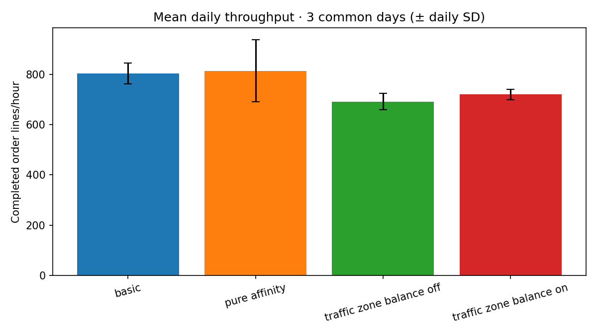
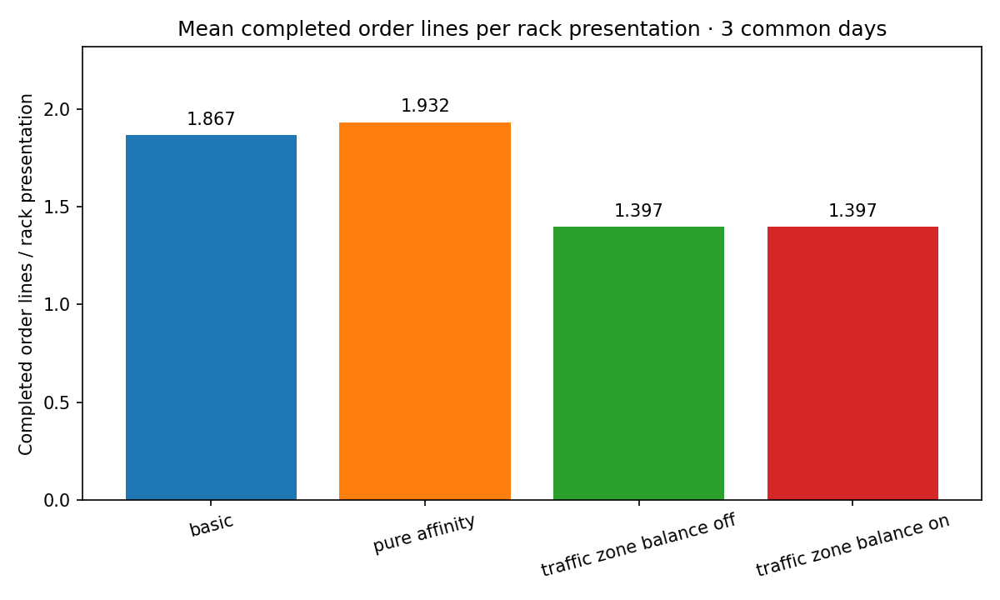
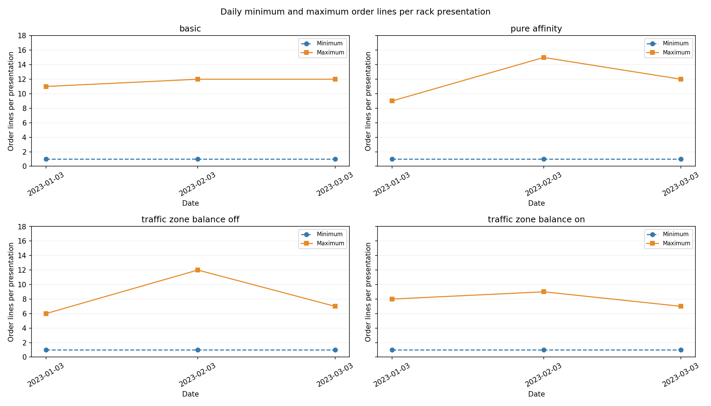
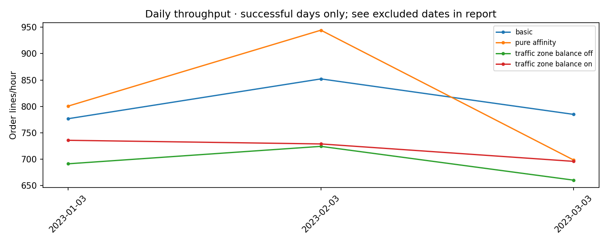
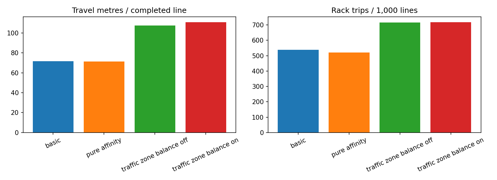
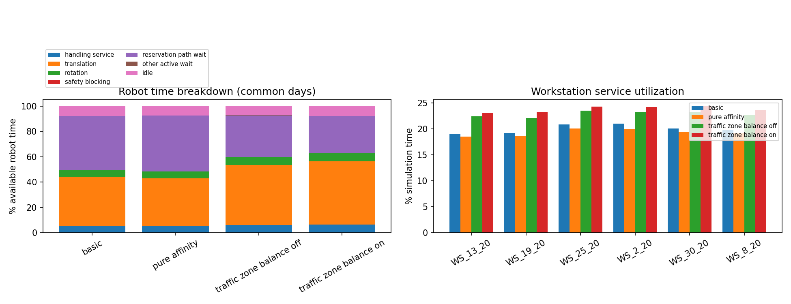
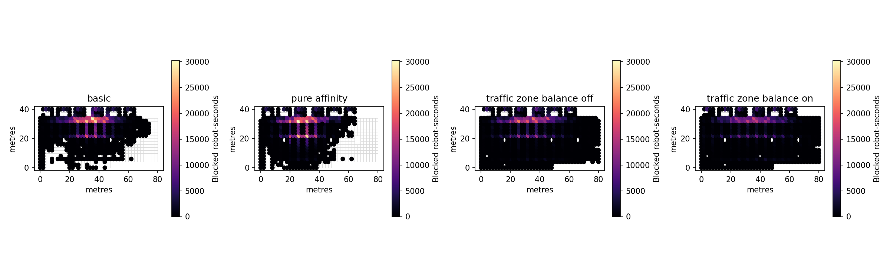

# Current-heat slotting comparison

Comparison status: **complete**. Baseline: **map1_basic**.

Primary metric: arithmetic mean daily completed order lines/hour. Lines complete after rack return and jack-down.
All layouts use the same 3 completed dates out of 3 requested dates.

Included dates: 2023-01-03, 2023-02-03, 2023-03-03

Excluded dates: none

| Layout | Strategy | Completed/requested | Mean lines/hour | Change vs baseline |
|---|---|---:|---:|---:|
| map1_basic | basic | 3/3 | 804.43 | +0.00% |
| map1_pure_affinity | pure_affinity | 3/3 | 814.37 | +1.24% |
| map1_traffic_zone_balance_off | ctbsa | 3/3 | 691.56 | -14.03% |
| map1_traffic_zone_balance_on | ctbsa | 3/3 | 719.87 | -10.51% |

Completed order lines per rack presentation across common completed days:

| Layout | Minimum individual presentation | Daily mean | Maximum individual presentation |
|---|---:|---:|---:|
| map1_basic | 1.000 | 1.867 | 12.000 |
| map1_pure_affinity | 1.000 | 1.932 | 15.000 |
| map1_traffic_zone_balance_off | 1.000 | 1.397 | 12.000 |
| map1_traffic_zone_balance_on | 1.000 | 1.397 | 9.000 |

## Throughput comparison

## Completed order lines per rack presentation

## Minimum and maximum individual rack presentation

## Daily throughput

## Travel and rack consolidation

## Robot activity and workstation balance

## Blocking hotspots on common days

## Interpretation and definitions

- Throughput bars use sample standard deviation across days, not a confidence interval. One day has no measured between-day variation.
- Completed order lines per rack presentation divides returned/jacked-down order lines by rack arrivals at workstation service. Unfinished returns contribute a presentation but no completed lines. No presentations means unavailable.
- The mean presentation chart shows daily averages. The separate minimum/maximum chart shows the smallest/largest covered order-line count of any single completed rack job on the common dates. Repeated visits by the same rack count separately; unfinished jobs are excluded from these extrema.
- Weighted throughput is total completed lines divided by total simulation hours over the common dates.
- Travel is actual substep displacement, split by loaded/empty state. Normalized travel and waits use completed source order lines, not units or distinct SKUs.
- Robot time categories are mutually exclusive. Utilization includes active waiting; movement and waiting charts explain the difference.
- Reservation/path wait includes an active robot lacking a granted next step. Safety blocking is separately counted. Neither is an explicit workstation queue-time measurement.
- Hotspots accumulate blocked robot-seconds at the desired next node when known, otherwise at the current node. Multiple robots' waiting times add together.
- Workstation utilization is actual service time divided by daily simulation duration; completed lines are credited after rack return.
- Replica layout differences should be zero. Strategy names describe input metadata and do not establish the cause of an observed performance difference.
- Current-heat coordination and motion rules are retained. These results do not establish deadlock freedom or physical collision safety.

Detailed results: [layout comparison](layout_comparison.csv), [paired daily differences](paired_daily_differences.csv), and per-layout/day CSV files.
